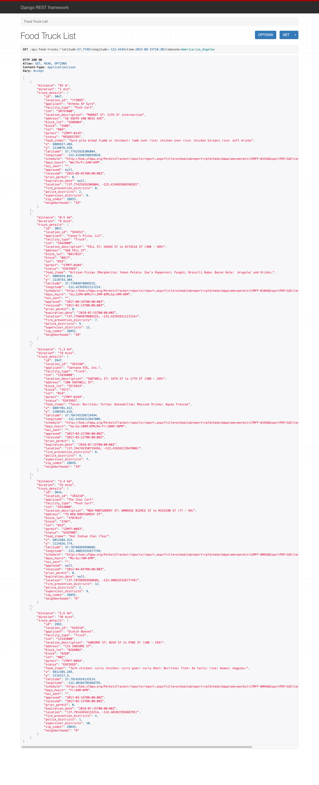
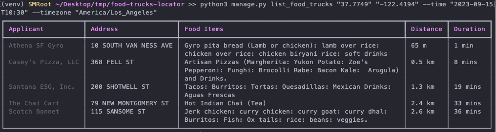

# Food Trucks Locator Project

## Introduction

Welcome to the Food Trucks Locator project! This application is designed to help users in San Francisco find food trucks based on their location, with an added feature to show only those that are open at a specified time.

## Features

### Database Population Script

- A custom Django management command populates the database from the provided CSV file.
- The script eliminates duplicate entries based on `locationid`, `latitude`, and `longitude`.
- Food trucks without latitude and longitude are excluded as they cannot be localized.
- Example usage:
  ```bash
  python manage.py load_food_trucks /path/to/food-truck-data.csv
  ```

### Working Hours Data

- The script also populates a relational table with each truck's working hours (if it has ones, otherwise populates with null).
- This data is crucial for filtering out trucks that are closed at the requested time.

### Requesting Food Trucks

- The API returns food trucks based on the user's latitude and longitude.
- When a `time` parameter is included in the request, the API filters for trucks open at that time.
- When a `time` parameter is included `timezone` parameter must also be included for accurate time calculations.
- Example request for top 5 close trucks (without considering opening days and hours):
  ```bash
  http://localhost:8000/api/food-trucks/?latitude=37.7749&longitude=-122.4194
  ```
- Example request with specific time and timezone:
  ```bash
  http://localhost:8000/api/food-trucks/?latitude=37.7749&longitude=-122.4194&time=2023-09-15T10:30&timezone=America/Los_Angeles
  ```
- **Rate Limiting**:
  - To ensure fair usage and protect the service from excessive requests, we implement rate limiting based on IP address.
  - The number of requests per minute is configurable via an environment variable `ANON_THROTTLE_RATE_PER_MINUTE`.
  - This helps to manage the load on our servers, especially since we do not have user authentication in place.
  - While aware that this can be bypassed by web scrapers using proxies, the approach was chosen for simplicity and to avoid more complex solutions like CAPTCHAs for this stage of development.

### CLI Command for Food Truck Listing

- Django management command for terminal-based food truck queries.
- **Usage Example**:
  ```bash
  python manage.py list_food_trucks "37.7749" "-122.4194" --time "2023-09-15T10:30" --timezone "America/Los_Angeles"
  ```
  or without time:
  ```bash
  python manage.py list_food_trucks "37.7749" "-122.4194"
  ```
- **Rich Library**: Enhanced visualization with the `rich` library for colorful and formatted output.
- **Output Details**: The command displays a table with columns for Applicant, Address, Food Items, Distance, and Duration for easy readability.

### Timezone Consideration

- Times in the dataset provided **are considered in UTC**.
- User-provided times must come with a timezone parameter for accurate comparison.
- User times **are converted to UTC** to check if the truck is open.

### Distance Calculation

- The top 10 closest trucks are first filtered by straight-line distance.
- From these, the top 5 are selected based on walking time using Google Maps API.
- To optimize performance, **multithreading** is employed to handle Google Maps API calls concurrently, reducing the wait time for responses.
- This approach balances accuracy with cost-efficiency.

### Caching System

- To optimize resource usage and reduce the cost of Google Maps requests, we've implemented a caching system.
- The caching system stores responses for specific requests based on parameters such as `latitude`, `longitude`, `user_time`, and `user_timezone`.
- When a request matches a previously cached one, the system returns the cached response, eliminating the need for redundant Google Maps requests.
- You can configure the caching period in the `.env` file using the `CACHE_TIMEOUT` variable, which defines the duration in seconds for which cached responses are considered valid.
- For simplicity, at this stage only HTTP requests get cached, but this can be implemented also for the CLI using persistent cache such as Redis, or through File-Based Caching, where we save or data locally in a static files.

## Setup and Installation

To set up and install the Food Trucks Locator project, follow these steps:

### Clone the Repository:

bash

```bash
git clone https://github.com/jalilbm/food-trucks-locator.git
cd food-trucks-locator
```

### Create a Virtual Environment (Optional but recommended):

bash

```bash
python -m venv venv
source venv/bin/activate  # On Windows, use `venv\Scripts\activate`
```

### Install Dependencies:

`pip install -r requirements.txt`

### Configure Environment Variables:

- A `.env` file is included in the project directory for easier setup and configuration.
- **Important**: The `GOOGLE_MAPS_API_KEY` is required for Google Maps integration but is not included in the `.env` file for security reasons.
- You will receive the `GOOGLE_MAPS_API_KEY` via email. Please paste it into the `.env` file in the appropriate variable field.

### Run Migrations:

`python manage.py migrate`

### Start the Development Server:

`python manage.py runserver`

### Access the Application:

The Food Trucks Locator API should now be accessible at [http://localhost:8000](http://localhost:8000).

### Run CLI Command:

You can use the CLI command for food truck listing as shown in the Features section.

---

## Project Context

This application was developed as part of RAKT's "Out-of-the-Box" Engineering Challenge, showcasing creativity and real-world problem-solving skills. It's designed with production-oriented practices and documents all technical decisions and trade-offs made during development.

The inclusion of the `.env` file and the separate handling of the `GOOGLE_MAPS_API_KEY` are decisions made to balance ease of setup with security considerations.

## 📸 Application Demonstrations

### Backend Response over HTTP

This screenshot demonstrates the typical JSON response structure from the backend when queried over HTTP.



### Backend Response via Django Command

Here's how the backend responds when queried using the Django command-line interface.


